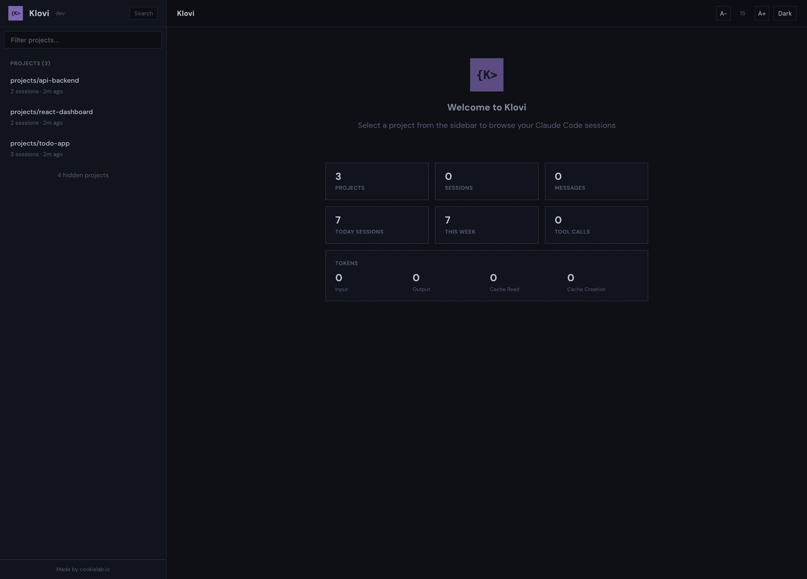
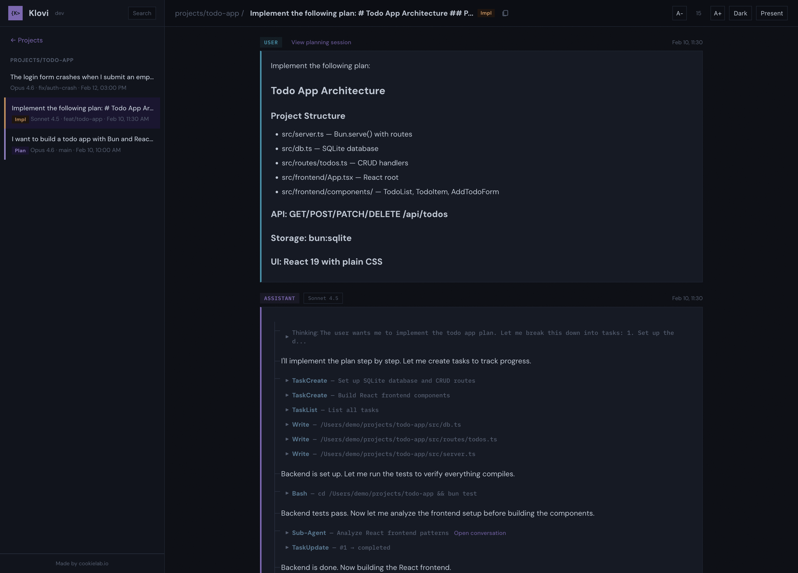

# Klovi

[](https://github.com/cookielab/klovi/actions/workflows/ci.yml)
[](LICENSE.md)

A native desktop app for browsing and presenting AI coding session history. Supports Claude Code, Codex CLI, and OpenCode. Built for showing AI coding workflows at meetups and conferences.




## Why Klovi?

AI coding tools like Claude Code, Codex CLI, and OpenCode store conversation history locally, but there's no unified way to browse, search, or present them. Klovi fills that gap: launch the app and get a native desktop UI to explore your full session history across all tools, review what AI assistants did across projects, and step through conversations in a presentation mode perfect for demos and talks.

Klovi auto-discovers sessions from Claude Code (`~/.claude/projects/`), Codex CLI (`~/.codex/sessions/`), and OpenCode (`~/.local/share/opencode/opencode.db`), then renders conversations with markdown, syntax highlighting, collapsible tool calls, and a step-through presentation mode. Projects from different tools that share the same working directory are merged automatically.

## Quick Start

Download the latest release for your platform from the [Releases page](https://github.com/cookielab/klovi/releases).

Or install via [Homebrew](https://brew.sh):

```bash
brew install cookielab/tap/klovi
```

### Development

```bash
bun install
bunx electrobun dev
```

## Features

**Multi-Tool Support**
- Claude Code, Codex CLI, and OpenCode sessions in one unified viewer
- Plugin-based architecture — auto-discovers tools from their default data directories
- Projects from different tools sharing the same working directory are merged
- Tool name badge shown on each session in the sidebar

**Session Browsing**
- Auto-discovers all projects across registered tools
- Dashboard statistics: project/session/tool counts, token usage breakdown, model distribution
- Filterable project list with session counts and last activity
- Hide/unhide projects to declutter the list
- Sessions show first message, model, git branch, and timestamp
- Plan/implementation session detection with colored badges and cross-session navigation links
- Full conversation rendering with user/assistant/system messages
- Sub-agent browsing: navigate into Task tool sub-agent sessions
- Copy resume command from session header (tool-specific: `claude --resume <id>`, `codex resume <id>`)

**Message Rendering**
- Markdown with GFM support (tables, strikethrough, task lists)
- Syntax-highlighted code blocks (language-aware, Prism)
- Collapsible tool calls with smart summaries (file paths for Read/Write/Edit, commands for Bash, patterns for Grep/Glob)
- Collapsible thinking/reasoning blocks
- Token usage display (input/output/cache tokens per assistant message)
- Timestamps on messages (relative time format)
- Tool result images rendered as clickable thumbnails with fullscreen lightbox
- File references (`@filepath.ext`) highlighted as green badges
- Image attachments displayed as media-type badges
- Slash commands shown with green `> /command` badge

**Presentation Mode**
- Step-through navigation: each conversation turn is a step, assistant turns have sub-steps (each text block is a step, consecutive non-text blocks like thinking and tool calls are grouped together)
- Keyboard controls: Arrow keys / Space to advance, Escape to exit, F for fullscreen
- Progress bar with step counter at the bottom
- Sidebar hidden, content full-width with larger font
- Fade-in animation for each revealed step

**Theme & Display**
- Light and dark themes (toggle in header or via View menu, persisted to localStorage)
- System theme auto-detection
- Font size control (+/- buttons or via View menu) for projector readability
- Native application menu with keyboard shortcuts

## Scripts

| Script | Description |
|---|---|
| `bunx electrobun dev` | Start development mode with hot reload |
| `bunx electrobun build` | Build native desktop binary for production |
| `bun test` | Run all tests |
| `bun run typecheck` | TypeScript type checking (`tsc --noEmit`) |
| `bun run lint` | Lint with Biome |
| `bun run format` | Format with Biome |
| `bun run check` | Biome check (lint + format, no write) |
| `bun run check:fix` | Biome check + auto-fix |

## Tech Stack

- [Electrobun](https://electrobun.dev) - native desktop framework for Bun
- [Bun](https://bun.sh) - runtime, bundler, test runner
- React 19 + TypeScript (strict mode)
- react-markdown + remark-gfm
- react-syntax-highlighter (Prism, oneDark theme)
- CSS custom properties for theming (no CSS framework)
- Biome for linting and formatting
- happy-dom + @testing-library/react for tests

## Documentation

See [docs/](docs/) for detailed documentation:

- [Architecture](docs/architecture.md) - project structure, data flow, component hierarchy
- [JSONL Format](docs/jsonl-format.md) - session file format specification
- [Components](docs/components.md) - frontend component guide and patterns
- [Testing](docs/testing.md) - test setup, patterns, and conventions
- [Content Types](CONTENT_TYPES.md) - catalog of all JSONL content types and rendering status

## Contributing

Contributions are welcome! See [CONTRIBUTING.md](CONTRIBUTING.md) for development setup and guidelines.

Please note that this project follows a [Code of Conduct](CODE_OF_CONDUCT.md).

## Built With

This project was built with love using [Claude Code](https://claude.ai/claude-code).

## Trademark Notice

"Claude" and "Claude Code" are trademarks of Anthropic, PBC. "Codex" is a trademark of OpenAI. This project is not affiliated with, endorsed by, or sponsored by Anthropic, OpenAI, or any other AI tool vendor. All trademarks and registered trademarks are the property of their respective owners.
