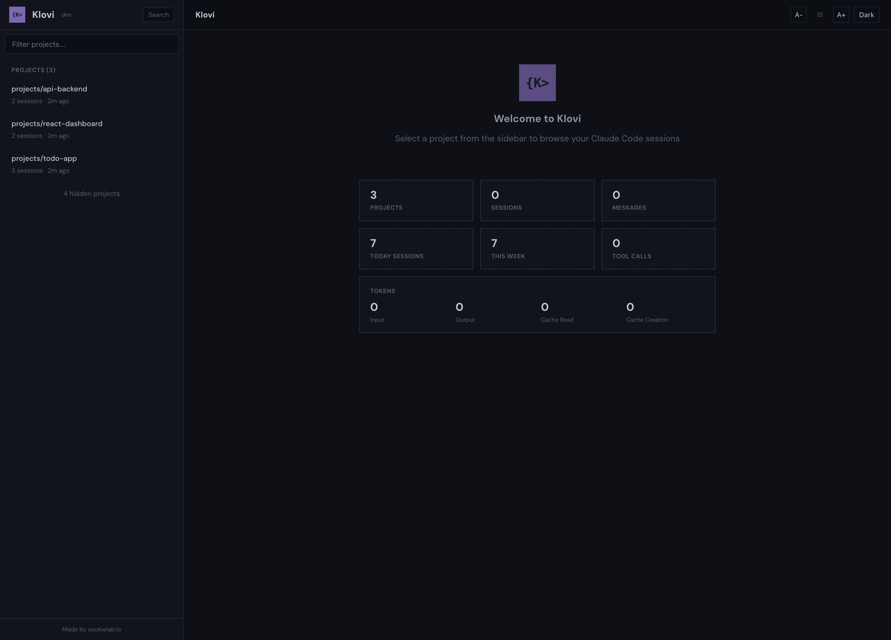
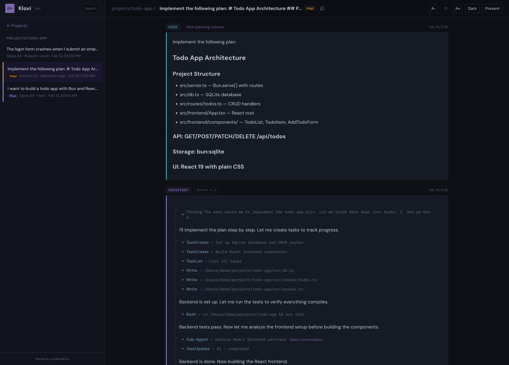

# Klovi

[](https://github.com/cookielab/klovi/actions/workflows/ci.yml)
[](LICENSE.md)

Klovi lets you browse, search, and present AI coding session history from
Claude Code, Codex, and OpenCode. It ships in two distribution modes that share
the same core UI and backend logic:

- Desktop app: native Electrobun shell with updater, menus, and directory picker
- npm package: `npx @cookielab.io/klovi` or `bunx @cookielab.io/klovi`, serving
  the shared UI in your browser on `127.0.0.1`




## Quick Start

### Desktop app

Download the latest release for your platform from the
[Releases page](https://github.com/cookielab/klovi/releases).

Or install via [Homebrew](https://brew.sh):

```bash
brew install --cask cookielab/tap/klovi
```

### Browser-served npm package

```bash
# Node.js
npx @cookielab.io/klovi

# Bun
bunx @cookielab.io/klovi
```

That starts a localhost-only server and opens your browser. For programmatic
embedding:

```ts
import { startKloviServer } from "@cookielab.io/klovi/server";

const server = await startKloviServer({ host: "127.0.0.1", port: 3583 });
```

Advanced CLI overrides:

- `KLOVI_HOST`
- `KLOVI_PORT`
- `KLOVI_STATIC_DIR`
- `KLOVI_SETTINGS_PATH`

## Development

```bash
bun install
```

Use the root workspace scripts that match the runtime you want to exercise:

- `bun run dev:desktop` starts the Electrobun desktop app
- `bun run dev:bun` starts the browser/npm variant through Bun
- `bun run dev:node` starts the browser/npm variant through Node/tsx

## Workspace Layout

### Apps

- `apps/package` - npm/browser distribution source for `@cookielab.io/klovi`
- `apps/desktop` - Electrobun desktop shell and release packaging

### Packages

- `packages/server` - internal backend API, Effect-based, dual runtime
- `packages/ui` - shared React app shell and transport-neutral UI bootstrap
- `packages/plugin-core` - plugin contracts and registry primitives
- `packages/plugin-claude-code` - Claude Code discovery, parsing, frontend integration
- `packages/plugin-codex` - Codex discovery, parsing, frontend integration
- `packages/plugin-opencode` - OpenCode discovery, parsing, frontend integration
- `packages/ui-components` - reusable Klovi-specific UI feature components
- `packages/design-system` - design tokens, primitives, and global styles

## Features

- Unified browsing for Claude Code, Codex, and OpenCode sessions
- Project merging across tools that share the same working directory
- Search across discovered sessions
- Session presentation mode for demos and talks
- Desktop-native capabilities in the Electrobun app
- Browser-served mode through a single npm package
- Plugin-specific tool summaries, input formatting, and resume commands

## Scripts

| Script | Description |
|---|---|
| `bun run dev:desktop` | Start the Electrobun desktop app in development |
| `bun run dev:bun` | Start the npm/browser variant with Bun |
| `bun run dev:node` | Start the npm/browser variant with Node/tsx |
| `bun run build` | Build the desktop app |
| `bun run build:web` | Build the shared UI bundle |
| `bun run build:package` | Build the npm/browser package source artifact |
| `bun run stage:npm` | Stage the sanitized npm publish artifact |
| `bun run verify:packed-artifact` | Verify the staged npm artifact under Node and Bun |
| `bun test` | Run the full Bun test suite |
| `bun run test:node-smoke` | Run the Node plugin runtime smoke test |
| `bun run typecheck` | Run TypeScript type checking |
| `bun run check` | Run Biome lint/format checks |

## Documentation

- [docs/architecture.md](docs/architecture.md) - runtime/package architecture
- [docs/components.md](docs/components.md) - UI layers and wrapper composition
- [docs/testing.md](docs/testing.md) - test setup and verification workflow
- [docs/arch2/VISION.md](docs/arch2/VISION.md) - canonical Arch2 target state
- [CONTENT_TYPES.md](CONTENT_TYPES.md) - JSONL content type catalog

## Contributing

See [CONTRIBUTING.md](CONTRIBUTING.md) for setup and workflow details.

## Trademark Notice

"Claude" and "Claude Code" are trademarks of Anthropic, PBC. "OpenAI",
"ChatGPT", and "Codex" are trademarks of OpenAI, Inc. "OpenCode" is a trademark
of its respective owner. This project is not affiliated with, endorsed by, or
sponsored by Anthropic, OpenAI, or any other AI tool vendor.
